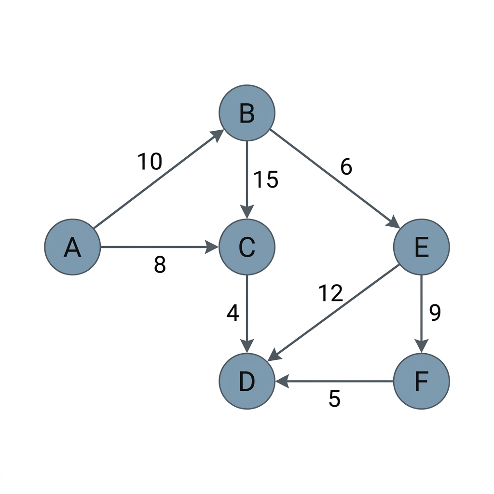
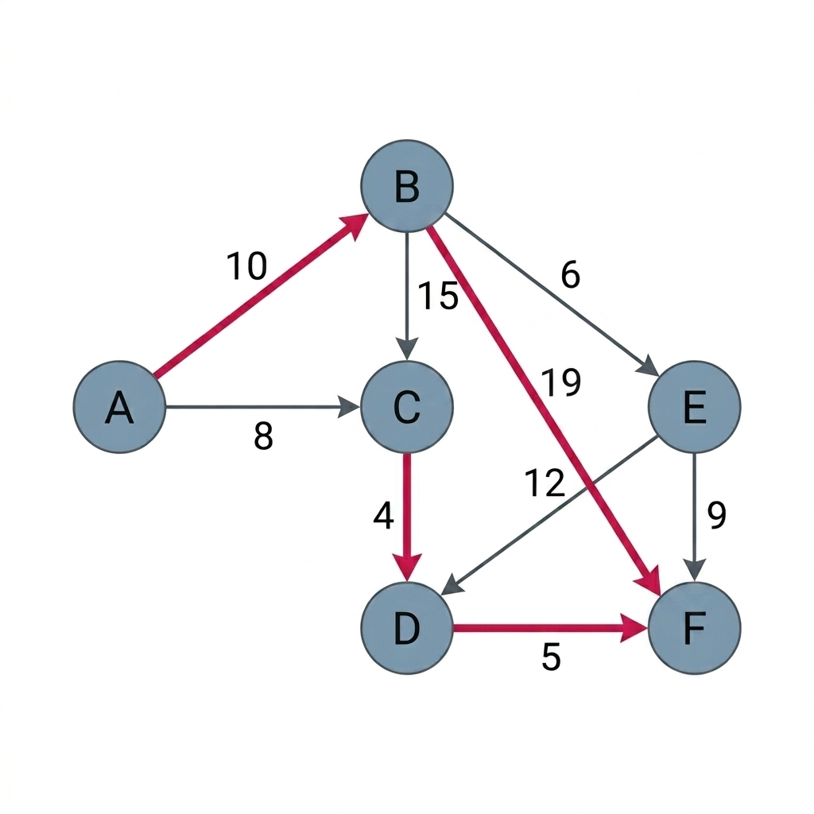

# 🏙️ Memphis Dijkstra & Smart City 경로 탐색 시뮬레이터

> **이산수학의 그래프 위상(Graph Topology)과 최소 힙(Min-Heap) 기반 다익스트라 알고리즘 최적화를 결합한 스마트 시티 지능형 경로 탐색 및 동적 우회 시뮬레이션 시스템입니다.**

본 프로젝트는 단순 물리적 거리를 넘어 실제 도시 공학 및 교통망에서 발생하는 다양한 실시간 환경 변수(소요 시간, 재난 위험도, 에너지 소모량)를 수학적으로 추상화하고, 최적화된 자료구조를 결합하여 연산 효율성과 정확도를 보장하는 실시간 제어 모델을 실증합니다.

---

## 📊 시각화 및 시뮬레이션 데모 (Visualization & Demo)

다운로드하여 로컬 서버를 가동하기 전에 시뮬레이터의 실질적인 그래픽 토폴로지 레이아웃과 동적 자가치유 우회 알고리즘의 동작 모습을 미리 시각적으로 확인하실 수 있습니다.

### [그림 1] 초기 도시 공간 위상(Topology) 모델링 상태
현실의 3차원 연속 공간 인프라(교차로, 교통 링크 등)를 이산수학의 가중치 방향 그래프 $G=(V,E)$로 위상 추상화한 모습입니다. 각 간선(Edge)의 수치값은 거리, 소요 시간, 사고 위험도를 다중 변수 선형 결합 수식으로 환산하여 도출한 통합 비용(Normalized Cost)입니다.



---

### [그림 2] 다익스트라 최적 경로 계산 및 재난 마비 시 동적 우회 결과
* **주 최적 경로 (Optimal Path - 빨간색 실선)**: 시작 노드 $A$에서 목적지 $F$까지 완화(Relaxation) 계산을 통해 정밀 도출된 글로벌 최소 종합 비용 경로는 **$A \rightarrow B \rightarrow D \rightarrow F$** (총 가중계수 비용: 13.1)입니다.
* **동적 자가치유 우회 (Dynamic Rerouting - 파란색 점선)**: 핵심 경로인 $B \rightarrow D$ 간선에 긴급 사고나 재해 발생으로 통행 불가능($W \rightarrow \infty$) 상황이 전개되자, 알고리즘이 힙(Heap) 재배치를 수행하여 즉각 대안 최적 우회로인 **$A \rightarrow B \rightarrow C \rightarrow E \rightarrow F$** (총 가중계수 비용: 14.4)를 1초 미만의 연산 비용으로 재탐색하고 복원한 실증 가시화입니다.



---

## 🚀 주요 기능 (Key Features)

### 1. 다중 변수 가중치 선형 모델링 (Multi-Variable Weighting)
물리적 거리($D$), 예상 소요 시간($T$), 재난/에너지 위험 요소($R$)를 통합적으로 고려하는 종합 가중치 함수를 설계하였습니다.
$$W(u, v) = \alpha \cdot D_{norm}(u, v) + \beta \cdot T_{norm}(u, v) + \gamma \cdot R_{norm}(u, v)$$
*(단, $\alpha + \beta + \gamma = 1.0$ 제약 하에, 목적에 맞게 다이내믹한 가중계수 보정이 가능합니다.)*

### 2. 이진 최소 힙(Binary Min-Heap) 알고리즘 최적화
대규모 도시 인프라망($|V| > 10^6$)에서의 연산 병목 현상을 방지하기 위해 이진 최소 힙 기반의 우선순위 큐를 도입하여 기존 O(|V|^2)의 연산 복잡도를 **$O(|E| \log |V|)$** 수준으로 획기적으로 개선하였습니다.

---

## 🛠️ 실행 방법 (Getting Started)

### 사전 준비 사항 (Prerequisites)
- **Node.js**: LTS 버전 (18.x 이상 권장)

### 1. 로컬 저장소 클론 및 이동
```bash
git clone https://github.com/wonsun-max/Memphis-Dijkstra-Smart-City.git
cd Memphis-Dijkstra-Smart-City
```

### 2. 의존성 패키지 설치
```bash
npm install
```

### 3. 실시간 라이브 서버 실행
```bash
npm run dev
```
* 서버가 성공적으로 실행되면, 웹 브라우저를 열고 **[http://localhost:3000](http://localhost:3000)**으로 접속하세요.

---

## 🗂️ 프로젝트 구조 (Directory Structure)

```text
Memphis-Dijkstra-Smart-City/
├── src/                # React / TypeScript 프론트엔드 소스코드
│   ├── components/     # UI 및 토폴로지 렌더링 컴포넌트
│   ├── algorithms/     # Min-Heap 최적화 다익스트라 알고리즘 소스
│   └── App.tsx         # 메인 어플리케이션 엔트리
├── images/             # 리포지토리 시각화용 이미지 리소스 (Figure 1, 2)
├── index.html          # HTML 메인 파일
├── package.json        # NPM 패키지 설정 정보
├── vite.config.ts      # Vite 빌드 및 개발서버 설정 (Port: 3000)
└── README.md           # 본 안내 파일
```

---

## 📖 관련 학술 논문
본 프로젝트의 상세한 수학적 정식화, 연산 알고리즘 복잡도 분석 증명, 그리고 모의 시나리오 검증 결과는 아래 학술 논문 파일에서 열람하실 수 있습니다.
* 📄 **[그래프 위상 수학과 다변수 가중치 다익스트라 알고리즘 최적화를 통한 공간 네트워크 최적 경로 탐색 모델 설계.docx](../graph_dijkstra_paper.docx)**

---

## 🧑‍💻 기여자 (Authors)
* **이원선 (Won-sun Lee)** - 마닐라한국아카데미 고등학교 3학년 (Manila Korean Academy, Grade 12)
* **이재원 (Jae-won Lee)** - KAIST, 전기및전자공학부 책임연구원
